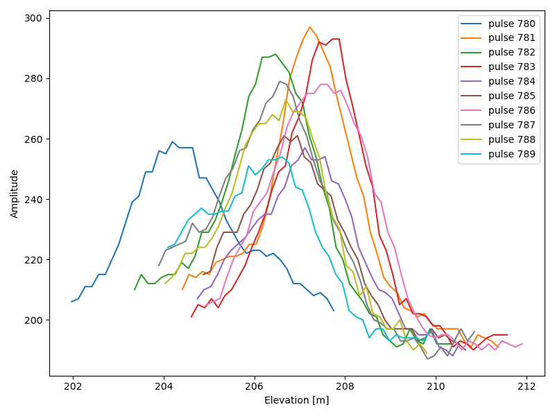
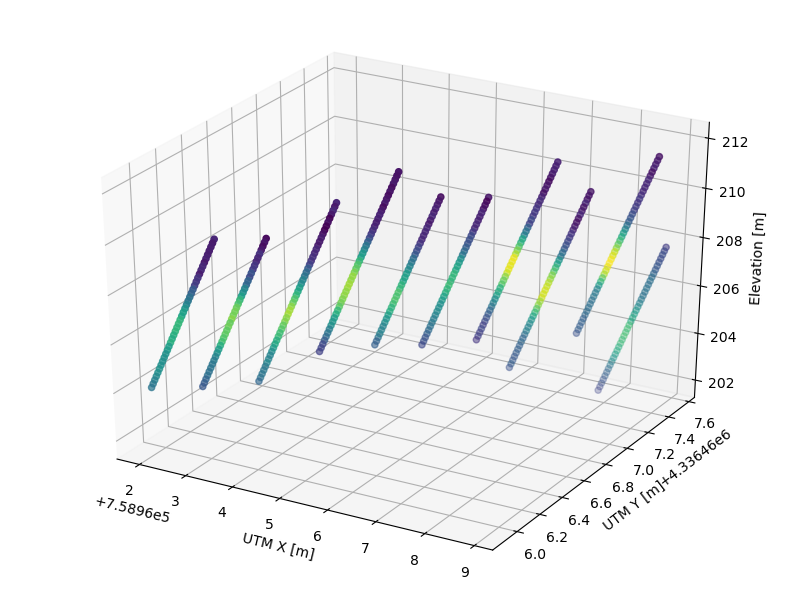

# PulseWaves

Python3 module for reading uncompressed lidar full waveform
**PulseWaves** files (PLS).

## Install

    git clone https://github.com/Rheinwalt/pulsewaves.git
    cp pulsewaves/pulsewaves.py ~/your/python/path

## Usage

```python
from pulsewaves import PulseWaves

f = PulseWaves('sample.pls')
f.export()
```

This will export all **Pulse Records** to an HDF5 file with the same
file name (e.g., sample.hdf). All **Wave** segments are stored in that
file including the coordinates for all amplitude samples of outgoing
and returning waveforms. Data is structured into three HDF group
datasets:

```python
import h5py

g = h5py.File('sample.hdf', 'r')
g.keys()
<KeysViewHDF5 ['Amplitude', 'Index', 'XYZ']>
```

The *Amplitude* dataset has two columns, the first for the actual
amplitude values (integers), and the second for an integer specifying
the segment number (0 for the outgoing wave, 1 for the first returning
wave segment, 2 for the second returning wave segment, etc.). Each row
corresponds to a sample. The same holds true for the dataset *XYZ*,
except that this dataset has three columns; one for each coordinate
(double). Which row corresponds to which **Pulse Record** is encoded
by the *Index* dataset (integer). Hence, the following would plot
the ten returning waveforms (all segments) from record 780 to 790 with
their amplitudes on the y-axis and the elevation on the x-axis:

```python
import h5py
from matplotlib import pyplot as pl

g = h5py.File('sample.hdf', 'r')
amp = g['Amplitude']
xyz = g['XYZ']
idx = g['Index']

fg = pl.figure(1, (8, 6))
ax = fg.add_subplot(111)

for i in range(780, 790):
    a = amp[idx[i]:idx[i+1], :]
    z = xyz[idx[i]:idx[i+1], 2]
    z = z[a[:,1] > 0]
    a = a[a[:,1] > 0, 0]
    ax.plot(z, a, label = 'pulse %i' % i)

ax.set_xlabel('Elevation [m]')
ax.set_ylabel('Amplitude')

pl.legend()
pl.tight_layout()
pl.show()
```



Showing the same waveforms in a 3D plot:

```python
import h5py
from mpl_toolkits.mplot3d import Axes3D
import matplotlib.pyplot as pl

g = h5py.File('sample.hdf', 'r')
amp = g['Amplitude']
xyz = g['XYZ']
idx = g['Index']

a = amp[idx[780]:idx[790]]
p = xyz[idx[780]:idx[790]]
p = p[a[:,1] > 0, :]
a = a[a[:,1] > 0, 0]
x, y, z = p.T

fg = pl.figure(1, (8, 6))
ax = fg.add_subplot(111, projection = '3d')
ax.scatter(x, y, z, c = np.log10(a))
ax.set_xlabel('UTM X [m]')
ax.set_ylabel('UTM Y [m]')
ax.set_zlabel('Elevation [m]')

pl.tight_layout()
pl.show()
```



Alternatively, one can load individual **Pulse Records** and **Waves**.
This is done as in the original Python2 version of this module:

```python
from pulsewaves import PulseWaves

f = PulseWaves('sample.pls')

# get the first pulse record
r = f.get_pulse(0)

# get the corresponding wave segments
w = f.get_waves(0)
print(w.segments.keys())
```
## Notes

See [laspy-waveform](https://github.com/Rheinwalt/laspy-waveform) for Python code reading waveform LAS/WDP files.
